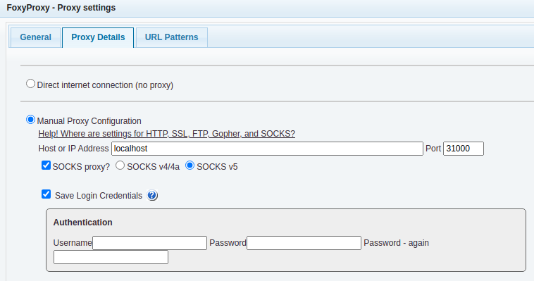

# PocketDUNE

Setup a demo installation of DUNE DAQ in a variety of setups.

## Quick-start

```bash
make setup.local
```

## Accessing services
For developer convenience, the cluster will have a http proxy running for you to access any services internal to the cluster.

This proxy runs on port `31000` and is usable using curl
```bash
$ curl --socks5 localhost:31000 --socks5-hostname localhost:31000 http://example-server
```

or a webbrowser using foxyproxy  



## supported setups

### locally on your own machine
This will create a single node cluster.  
The only requirement is a working installation of `docker`, other binaries required for setup are downloaded automatically and require no sudo privileges.
```bash
$ make setup.local
```

To destroy after you finished, run
```bash
$ make destroy.local
```

### CERN OpenStack
This will create a two-node cluster (by default). You will need Python3.8 or higher and ssh client on your local machine. Other binaries required for setup are downloaded automatically and require no sudo privileges.

You will need to authenticate with CERN OpenStack, the makefile will help you do that if you don't know how.
```bash
$ make setup.openstack
```

To destroy after you finished, run
```bash
$ make destroy.openstack
```